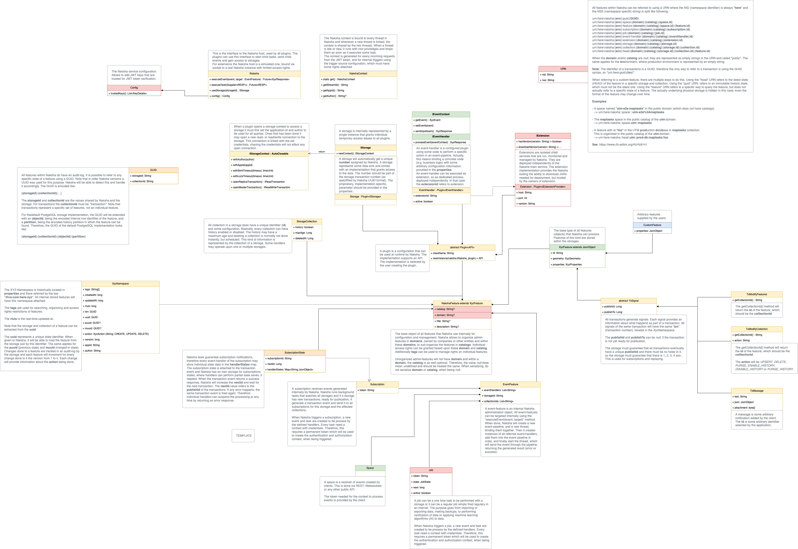

# TODO

This is a TODO list of short, medium and long term EPIC's and individual tasks.

## Open Questions

### Country Geometries

We need to clarify where we get country geometries and details, and solve the problem that country geometries are too big.

## Event-Targets

### Spaces-API - [MCPODS-6206]

Finish access to the public spaces via `/hub/spaces` path.

### Space-Features-API - [MCPODS-6207]

Finish access to the public spaces via `/hub/spaces/{id}/features` path.

### Subscriptions-API (23/Q4)

Finish access to the public subscriptions via `/hub/subscriptions` path.

### Subscriptions-State-API (24/Q2)

Finish access to the state of the public subscriptions via `/hub/event-targets/subscriptions/{id}/state` path. It should be possible to reset the state to a more early **nextId**, so that it effectively will perform a replay. Setting **nextId** to zero will cause the first known transaction to be delivered. Setting it to a negative value, will ask Naksha to seek to the last known transaction, add one and then add the given value, starting from there. So providing `-1` will effectively only return new transaction after the change of the state. This is the initial default value for `undefined` or `null`.

### Jobs-API (24/Q2)

Finish access to the public jobs via `/hub/jobs` path.

### Change-Set-API (24/Q1)

Support access to the history in a XYZ-Hub compatible way, using the [Change-Set implementation of XYZ-Hub](https://interactive.data.api.platform.here.com/openapi/). The corresponding files can be found [here](https://github.com/heremaps/xyz-hub/tree/12be844d724b3d69518754958b0422546d948cc0/xyz-models/src/main/java/com/here/xyz/responses/changesets).

The idea is to simply support this via `/hub/spaces/{id}/changesets` and to use the **publishId** as version.

## Plugins

### Code-API (24/Q2)

We want to provide a read-only API to review what code event-handlers and storages can use. So requesting `GET /hub/plugins/code` should list the class-names of all implementations with some form of description what they do. Actually the *IPlugin* interface should have the methods `getCodeDescription()` and `getCodeTitle()` that return a description of what the code does. This differs from the `title` and `description` properties of the `Plugin` features them self in that these methods return the implementation details of the code, while the others describe the usage of the code in the context of an application, and the later are customer defined, while the methods are hardcoded and return implementation specific documentation. 

### Event-Handlers-API - [MCPODS-6208]

Refactor **Connector** to **EventHandler** and allow access to public event-handler via `/hub/plugins/event-handlers` path.

### Storages-API - [MCPODS-6207]

Allow access to public storages via `/hub/plugins/storages` path.

### Extension-API (24/Q2)

Allow access to public extension via `/hub/plugins/extensions` path. This is in an ongoing discussion, what exactly should be part of this API.

## Naksha Core-Lib

### Refactor Connector to EventHandler (23/Q3)

## Naksha-Hub

### JDK-21 Project Loom

We should upgrade to JDK 21 to test the new project loom features. This will be especially helpful for our subscription observers and for all the event-pipelines.

### NFKC StringCache - [MCPODS-6201]

We need to ensure that we apply [NFKC](https://docs.oracle.com/javase/tutorial/i18n/text/normalizerapi.html) normalization to all strings, which we should add to our string-cache. We use this everywhere, this will ensure that all our strings are [NFKC](https://docs.oracle.com/javase/tutorial/i18n/text/normalizerapi.html) normalized. This is not only important to reduce attack vectors, but as well to guarantee that different inputs return always the wished result and that we store the least amount of bytes. 

### Bootstrap - [MCPODS-6200]

When booting Naksha, the service itself need to create some internal event-handlers and spaces. We need internal spaces for `spaces`, `subscriptions`, `jobs`, `event-handlers` and `storages`. Each space does need to have two internal handlers, one performing the authorization and another one using the default storage handler to persist changes or perform reads.

### JWT (23/Q3) __decision__

We need to finish our discussion how to load the JWT key files. Currently, the suggestion is to simply put them into the configuration file, which normally loaded from the database. The argument to stick with this is, that we only change them rarely, and we do not want to re-deploy the service in that case, only restart, when new keys become available. On the con-side, this makes automated key updates more complicated for CI/CD pipelines, but the question is: Do we need this? We only trust the Map Creator middleware, and this can stick with the same key for a long time, there seem to be no need to change this too often. 

However, ensure that config file loading works as expected:

- Bootstrap service via: `java -jar naksha-all.jar {jdbc-admin-db-url}[ {config-id}]`.
  - If no **config-id** was provided, read the environment variable `NAKSHA_ENV`, if not set, use `local` as default.
  - If no JDBC URL given, try to read it from the `NAKSHA_ADMIN_DB` environment variable (not recommended to use this, because it may be potentially unsafe). If that fails as well, exit with an error.
- Try to load the configuration with the given **config-id** from the database.
  - If no such configuration exists, try to load from config directory as specified by the [XDG Base Directory](https://wiki.archlinux.org/title/XDG_Base_Directory), so try to load from `~/.config/naksha/{config-id}.json`.
  - If that fails as well, try to load from resources of the JAR using the filename `{config-id}.json`.
  - If that fails again, abort with an error message.

### NakshaContext - [MCPODS-6203]

We need to ensure that the Naksha context works always as designed, so that there is always an **appId**, optionally an **author** and that a **isSupervisor()** method is available.

### INaksha interface - [MCPODS-6170]

We need to ensure that the proposed methods exist and are working (*executeEvent*, *executeTask*, ...).

### IStorage - [MCPODS-6170]

We should simplify the reader and writer and integrate their functionality directly into the *IReadTransaction* and *IMasterTransaction* interfaces, at least I see no need for them to exist (anymore).

We need to remove the `addListener` and `removeListener` methods for now, but rather add some way to poll the transactions.

Adjust to architectural changes proposed in 

### Internal-Storage-Observer (23/Q4)

Implement the internal storage observer that then can generate `TransactionEvent`'s and trigger the subscriptions. The basic concept is to fork a new thread for every subscription and to observe it. This can later be optimized in only observing a storage ones and distribute for all subscriptions and then further, by using the PostgresQL `NOTIFY` feature to let PostgresQL notify the application when something new happens.

The first simple implementation can be like `SELECT * FORM tx WHERE publish_id = state.nextId`.

### JWT token handling (24/Q3)

Ensure that JWT token handling works as expected, including signature checks and public key importing. This includes finishing the documentation, for example how to create new key-pairs and how to sign and generate JWT tokens, especially for the local debugging use-case.

### In-Memory Cache (24/Q1)

Implement an im-memory cache that wraps another *IStorage* and allows to keep the complete content and/or partial content in memory. Optionally limited to certain collections.

### Fat-Jar - [MCPODS-6205]

Ensure that a fat-jar is created and available for deployment.

### Fix CI/CD testing (24/Q4)

Ensure that the CI/CD pipeline starts a local PostgresQL and then performs the gradle build with enabled the database tests. Ensure that the database tests only execute, when the corresponding environment variable set.

### Error Handling - [MCPODS-6204]

Naksha-Hub will register a response handler for all created events, being executed. This response handler should basically create error responses in two distinct ways: XYZ-Hub compatible (default) and Naksha compatible (only if HTTP Header `X-Naksha-REST: v1` is provided.

Internally, the event-handlers of the event-pipelines **must** not make any assumptions about which protocol used to transport the result back to the client. They all should simply return a valid `XyzResponse`, which will either reflect the expected result or an error. Beware, when requested features are not found, no error **must** be returned, but rather an empty result-set is expected.

The Naksha REST response handler will always return 200 OK and the response. It will only return any other error, if some error happens that prevents the event creation (for example there are already too many requests ongoing).

This is different for the XYZ-Hub compatibility response handler. This will for example return 404 Not Found, when a single feature is requested, but was not found (so an empty result-set returned). It will have other odd hacks to return 201 Created in some cases, and other responses in other cases. It will be full of workarounds, that only makes the situation more complicated for the server and client, but is what everybody else is currently doing with REST.

### Naksha release versioning **PENDING**

We decided that the version differs per branch, so feature-branch -> 2.x.r / dev -> 3.x.r / e2e -> 4.x.r / prd.
We need to rethink this, there problems about releasing.

### Develop branch (23/Q4)

Migrate develop branch changes to maintenance branch (including custom metrics).

### Prepare usage (23/Q3 -> 24/Q2)

We need to provide admin-tokens and instructions how to create event-handlers, pipelines, spaces, storages, views and so on to front-end team (Chris).

This includes instructions in confluence how to prepare the default storages, spaces, handlers, subscriptions and everything else needed for the topology-view, topology-violations-view, topology-test-view aso.

## Events

### Transaction-Event (23/Q3)

Declare the new transaction event. Make the features an optional parameter that is attached by the feature-loader.

### GetHistoryEvent, SearchHistoryEvent (23/Q3 -> 23/Q4)

Declare a request to get history (transactions) and to search in it. The event names are unclear and functionality as well, we need to discuss this. What we need for UniMap Editor and Map-Creator are at lest the following functions:

- GetHistoryFeaturesById(feature.id) // this requires then activity-log-handler
- GetHistoryFeaturesByTag(tag) // sourceId as tag (id of map-task, meta-ns), diff needed (this needs a second fetch)
- GetHistoryFeatureByUuid(uuid) // diff-needed
- GetTransactionByTxn(txn | publishId) // diff-needed, this is helpful feature (we can delay)

Annotations:

- All results should be sorted by time. (can be delayed, but needed)
- We can allow limits based upon feature number and (maybe) maximum byte-size. (can be delayed, not needed, just optimization)

**Note**: For being downward compatible with XYZ-Hub we need to use the **publishId**, because XYZ-Hub has a version that is a number, and our **publishId** is exactly the same, even while internally we rather operate with transaction-numbers being strings.

### ModifyFeaturesEvent (23/Q4)

Extend the `ModifyFeaturesEvent` so that context features can be attached. This is a requirement before the Context-Loader can be implemented.

Additionally, we need to allow modification of multiple collections with one request, this is a pre-condition to implement the endorse-handler.

## Extension-Hub

### Extension-Hub release versioning **PENDING**

We decided that the version differs per branch, so feature-branch -> 2.x.r / dev -> 3.x.r / e2e -> 4.x.r / prd.
We need to rethink this, there problems about releasing.

See: Same as for Naksha-Hub!

### Deployment DEV pipeline for Extensions (23/Q4)

Finish the DEV deployment pipeline for extensions.

### Improve documentation (24/Q2)

Complete Extension guideline documentation, add relevant samples, create a [Kotlin Notebook](https://blog.jetbrains.com/kotlin/2023/07/introducing-kotlin-notebook/).

### Multi-Handler optimization (23/Q3)

The Extension-Hub should be able to execute multiple handlers in a row. Basically we want to redirect a part of the event-pipeline to the Extension-Hub. This requires some protocol changes and Extension-Hub improvements. We need to ensure that the auto-wrapping of extensions continues to work.

If we do not do this, there will be a lot of data transfer between the Extension-Hub, and the Naksha-Hub that is unnecessary.

### Extensions deployment (24/Q1)

We need to ensure that extensions can be deployed in DEV environment.

### Finish the DCU extension (23/Q4)

We need to add the context-loader, validation-handler and optionally as well the endorse-handler into the DCU extension. For this purpose, the extension host may need to grant access to the admin-database.

### Improve Naksha protocol to HTTP/1.1 Upgrade (23/Q4)

We use our own protocol for the extensions. We should at least create a handshake that uses HTTP Upgrade to ensure that ALB works well.

### Improve protocol to use WebSockets (24/Q1)
 
We should use WebSockets for the extensions. In fact, long term this should be used to as well allow external clients (including web-clients) to connect to Naksha and process events. This allows any browser to become an own extension in some form or at least to get much better including into the Naksha event handling. This is the right way to later add sub-protocol to allow chats or geofencing.

### Consistent Store Connector Guidance **NA0032**

Support DCU team in writing the consistent store connector.

## PostgresQL

### Moderation-DB - [MCPODS-6167]

We need to make the moderation-db available so that DCU can test DLB.

### Artifactory deployment (23/Q3)

Make the most important changes in the API (*IStorage*, ...) and then deploy to HERE artifactory. Provide the artifact to DCU to test DLB.

### Add Subscriptions-State (23/Q3)

Add support for the subscription-state collection.

### Add binary (23/Q3)

Add support for binary to later allow storing protobuf or other binary representations.

### Convert tags to map (23/Q3)

Change the tags to be an array or map. If being a map, do not allow values that are not string, number or boolean. 

Store the tags in a separate column (in-front of the jsonb and binary). We should add a **GIN index** above the tags and allow searching for them using all kind of operations (greater-than, less-than, ...). We will not allow to search for any arbitrary properties. The tags should be either an array, or a JSONB object with values being only string, number or boolean (no matter if being an array or map). This is necessary to keep insert and search performance in balance.

### Add Tx-Sequencer (23/Q4)

Port the old sequence into the PsqlStorage implementation.

### Improve publishing using notification (24/Q2+)

Instead of polling, use the NOTIFY / LISTEN feature of PostgresQL to detect new transactions.

### Support import/export handling (23/Q4)

Add the ability to modify XYZ namespace handling.

Allow to fully disable `__naksha_trigger_fix_ns_xyz`, so that the XYZ namespace is no longer auto-managed. This should retain the history trigger, so it only disables the XYZ namespace updates.

Support an alternative `__naksha_trigger_fix_ns_xyz_import` trigger, which should only auto-generate values that are not explicitly given in the INSERT operation. It should still work the same way like the default `naksha_trigger_fix_ns_xyz` for UPDATE and DELETE. For this alternative namespace handling we should retain the history trigger, so this only modifies the XYZ namespace updates. 

## Platform Storage (24/Q2)

Implement a HERE Platform catalog storage and an Interactive-Map-Server (IMS) storage. This allows to read data from IMS and catalogs through Naksha.

## Handlers

### Activity-Log-Handler (24/Q2)

Convert features in the result-set into the Activity-Log format. This likely will require a change-set result.

**To Clarify**: To simulate activity-log compatibility in a space, we may need to turn a GetFeaturesByIdEvent() into a GetFeatureByUuidEvent(), because that is how activity-log operates, it swaps UUID and ID. Additionally, it need to translate SearchFeaturesEvent() into FindTransactionsByTag(). Maybe there is more to do. **But do we really need this effort?**

### Change-Set-Handler (24/Q1)

Implement a change-set handler that reads from our history and converts the result into a change-set collection. This injects the **publishId** into the XYZ-namespace as **version**.

### Authorization-Handler (24/Q1)

Create an authorization handler that performs authorization based upon the feature type and as described in the Nakhsa [authorization](./AUTH.md) document. The basic idea is, that every **EventTarget** automatically adds the authorization-handler as first handler into the event-pipeline, except the current **NakshaContext** has the supervisor flag set (**su** in the JWT token). This allows supervisors to by-pass all authorization restrictions.

**Note**: Add the authorization handler behind every extension-handler, so that the extension-handler can't by-pass security restrictions. Do not trust client access matrix!

### Tag-Handler (23/Q4)

Create a handler that can create tags from properties. Actually, we only allow searching in tags and map creator need to search for features in the history by the value of a property being "sourceId" and/or by user.

### Default-Storage-Handler (23/Q4)

Create a handler that actually implements the event processing using the storage referred by the **storageId** property of the **space** attached to an event. This space is the event-target. Additionally, the default implementation should read from/write to the configured *collection*, if none configured, the first *collection* should be used.

### View-Handler [MCPODS-6193]

Implement the view handler that allows reading a stack of spaces. The basic concept is the following:

- Read the identifiers of all configures sub-spaces (must be an ordered list).
- Refer to *INaksha* to get the declaration of the sub-spaces, so we can target events to them.
- Create new child events and then them to the declares spaces in parallel using the `executeEvent(event, target)` method of Naksha.
  - **Note**: Maybe we can allow as target just the identifier of the space instead of having to provide the space object!
- Merge the response of the events.

Actually for all write requests, only one space should be the target. The target may be explicitly selected, if not selected, the default should always be the most top (last) sub-space.

Merging the response normally means only to drop lower level results, coming from sub-spaces that are in-front of the current lower one. Actually only the most top feature should be returned.

There is one special case: Bounding box queries. In this case, features being in the lower level spaces, but not in the higher level spaces, need to be requested again by their identifier from the higher level ones, because they may just have been moved out of the requested bounding box.

### UniMap-Filter-Handler (24/Q1)

Implement a handler that removes features in the *change-state* **REMOVED** from the result-set. Basically, we want some arbitrary filtering of features, not sure about the handler name and exact functionality. 

### Tx-Feature-Loader (24/Q4)

Implement the transaction-feature-loader, which will load all features involved into a `TransactionEvent`. 

### Tx-To-ModifyFeatures-Converter (23/Q4)

Create a handler that can convert a `TransactionEvent` into a `ModifyFeaturesEvent`.

### SNS-Publisher (24/Q4)

Implement the SNS publisher as needed by UTM. It may be configurable, so that we can later extend it. For example, it can be consuming or not consuming (to allow some post-processing). 

### Validation-Context-Loader (23/Q4)

Implement a handler that loads the validation-context. This one needs access to the storage.

### Validation-Handler (23/Q3 -> 23/Q4)

Finish the validation handler using the provided libraries. We should ask the *Violation Library* for the default rules, this must be implemented by this library, for example *getDefaultRules()*. Otherwise, we risk to run asynchronous with the DCU stream-processing.

### Endorsing-Handler (23/Q3 -> 23/Q4)

Decide, which features are `AUTO_ENDORSED` and, which are `AUTO_REVIEW_DEFERRED`, based upon the previous validation-handler.

Actually we have three possible outcomes:

- No new base or delta violations or only ones, that are LE - `AUTO_ENDORSE`.
- Unexpected errors happened or new delta/base violations found, that are not LE: `AUTO_REVIEW_DEFERRED`.

LE exceptions are *Legacy Exceptions*. We use the *Validation Storage Library* to know about all existing violations and if they are LE. In fact, we need a background job to cache all known base validations, they change not that often (max ones per minute) and are accessed often, the amount is limited. We do not expect more than 5 million.

Note that we need to use *Validation Management Library* to get unique identifiers for violations and to compare two violations (delta and base) to find duplicates.

The endorser needs to cleanup the violations-delta. For example, when the underlying feature was integrated, the endorser need to delete the violations from the delta, the same it will store additional new violations, when needed. This means, the endorser need to watch the delta, DLB and violation-delta.
 
### Event-Store-Uploader **EXTERNAL**

Implement a handler that uploads endorsed features to the event-store, flagging them as endorsed and uploaded.

## Migrations / Admin

- Naksha DB migration script for v2
- Space DB migration script for v2
- Additional Cloudwatch metrics for v2 (e.g. maintenance job timings, failures)
- Additional Alarms for v2 (e.g. maintenance job failures)

If there is existing delta/violation data, clarify what does exists and how to convert; if we need the converting at all.

### Legend

- `jw`: Java Developer Week. Assumption is a 35h work week of a medium senior JAVA developer, who has good knowledge of Java (JDK 17+) and Gradle with Kotlin build scripts (`build.gradle.kts`).
- `ow`: Operation Week. Assumption is a 35h work week of a medium qualified operation administrator, that has experience with AWS, EC2, CloudFormation.

### [Dead Letter Bucket Strategy](https://jiraweb.it.here.com/browse/CP-53254) [8 jw]

Topic wise this should simply be stored in the Moderation DB using the Naksha LibPsql.

Update confluence for Wikvaya/Naksha (estimation colum)

- Update the profile of all users (if possible), so that the UI shows the correct realm and account-type.
- Update countries (Naksha?).
- Create an runbook (on-call).
- Install new SSH keys for on-call people.
- Register deletion handler with HA.
- Memory-Leak issue.
- New deployment with new EC2 instances (using Naksha templates?).
- Introduce Areas/Regions (must not be overlapping), so for example EUROPE. This should be additional to country, so rights can be granted based upon individual countries, list of countries or REGIONS (allows us to make pseudo regions, for example embargo countries, disputed areas, ...).

